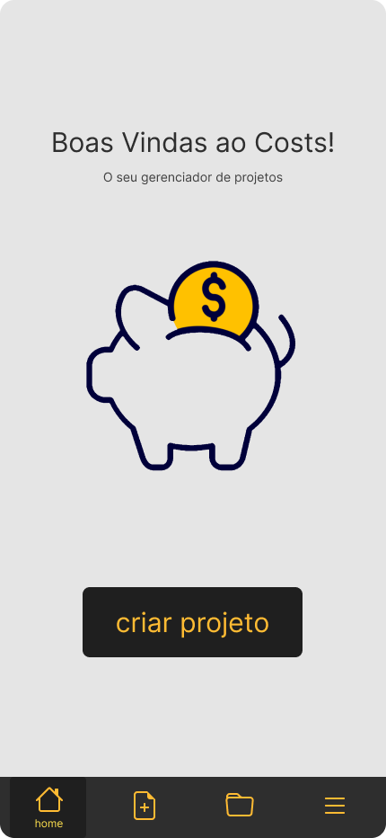
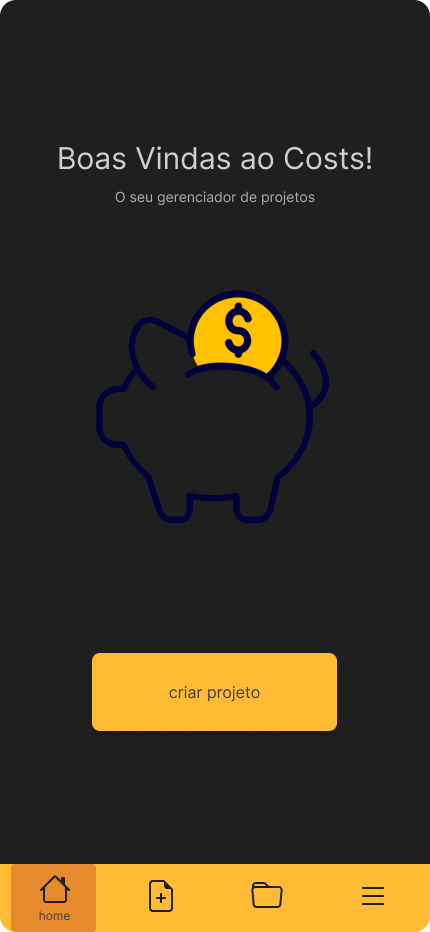

# Flutter

## Gerenciador de Projetos

Um projeto Flutter

## Preparação

Esse projeto tem como objetivo o aprendizado da framework [Flutter](https://github.com/flutter/flutter)

Para ajuda ao iniciar projetos em Flutter, visite a
[documentação online](https://docs.flutter.dev/), que oferece tutoriais, exemplos, guias em desenvolvimento mobile, e uma referência completa na API.

## Instalação

> Para executar este projeto, verifique os requisitos de instalação do Flutter na documentação online.

-   Faça o clone desse projeto em algum diretório no seu computador
-   Abra um terminal neste diretório e execute o comando

```py
flutter emulators --launch <id_do_emulador>
```

-   Após inicializar o emulador, execute o projeto com o comando

```py
flutter run
```

### Documentação

Este projeto tem como formato um aplicativo de celular para que o usuário possa gerenciar projetos pessoais de maneira rápida.

Tendo opções de separar os projetos por `categorias` para facilidar os filtros.

Opções para adicionar e remover `serviços` aos projetos a fim de manter uma documentação do montante gasto.

## Screenshots

### Home

</img>
</img>

### Criar projeto

</img>
</img>

### Meus projetos

</img>
</img>
